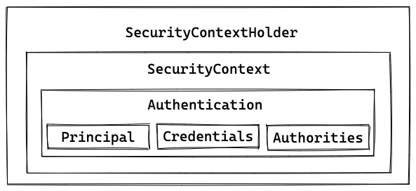

## SecurityContextHolder, SecurityContext, Authentication

> ### SecurityContextHolder

- `SecurityContextHolder`
  - `SecurityContext` 데이터를 쓰거나 읽을 수 있는 API를 제공한다.
  - 기본 구현으로 `ThreadLocal`를 이용하고 있다.
    - `Thread Per Request` 모델을 기본 고려했음을 의미한다.
    - `FilterChainProxy` 구현
      - finally 블록에서 `SecurityContextHolder.clearContext()` 를 호출한다.
      - HTTP 요청 처리가 완료되고 `Thread`가 `ThreadPool`에 반환되기 전에 `ThreadLocal` 변수 값을 제거하기 위함이다.


> ### SecurityContext

- `SecurityContextHolder` 클래스를 통해 코드 어느 부분에서든 `SecurityContext`에 접근할 수 있다.
- `SecurityContext` 자체는 특별한 기능이 없다.
  - 그러나 `org.springframework.security.core.Authentication` 객체를 Wrapping 하고있다.

```java
public interface SecurityContext extends Serializable {

	Authentication getAuthentication();

	void setAuthentication(Authentication authentication);

}
```

> ### Authentication

- `Authentication`
  - 사용자를 표현하는 인증 토근 인터페이스이다.
    - `Principal`
      - 인증 주체를 표현한다. 
    - `GrantedAuthority`
      - 사용자의 권한을 의미한다.
  - `AnonymousAuthenticationToken` 클래스
    - 익명 사용자를 표기하기 위한 `Authentication` 인터페이스 구현체
  - `UsernamePasswordAuthenticationToken` 클래스
    - 로그인 아이디/비밀번호 기반 `Authentication` 인터페이스 구현체
  - `RememberMeAuthenticationToken` 클래스
    - `remember-me` 기반 `Authentication` 인터페이스 구현체
  - 인증 완료된 사용자, 인증되지 않은 사용자 모두를 표현한다.
    - 인증 여부를 확인할 수 있다.
    - 사용자 인증 완료 여부에 따라 `Principal` 값이 달라진다.
      - 로그인 전 Principal : `로그인 아이디 (String)`
      - 로그인 후 Principal : `org.springframework.security.core.userdetails.User` 객체

    
