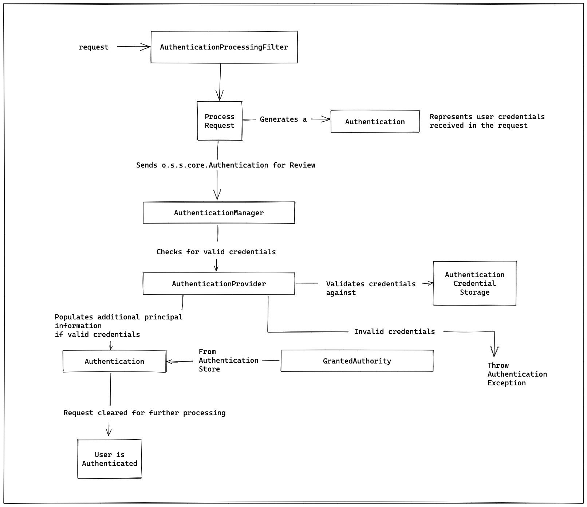
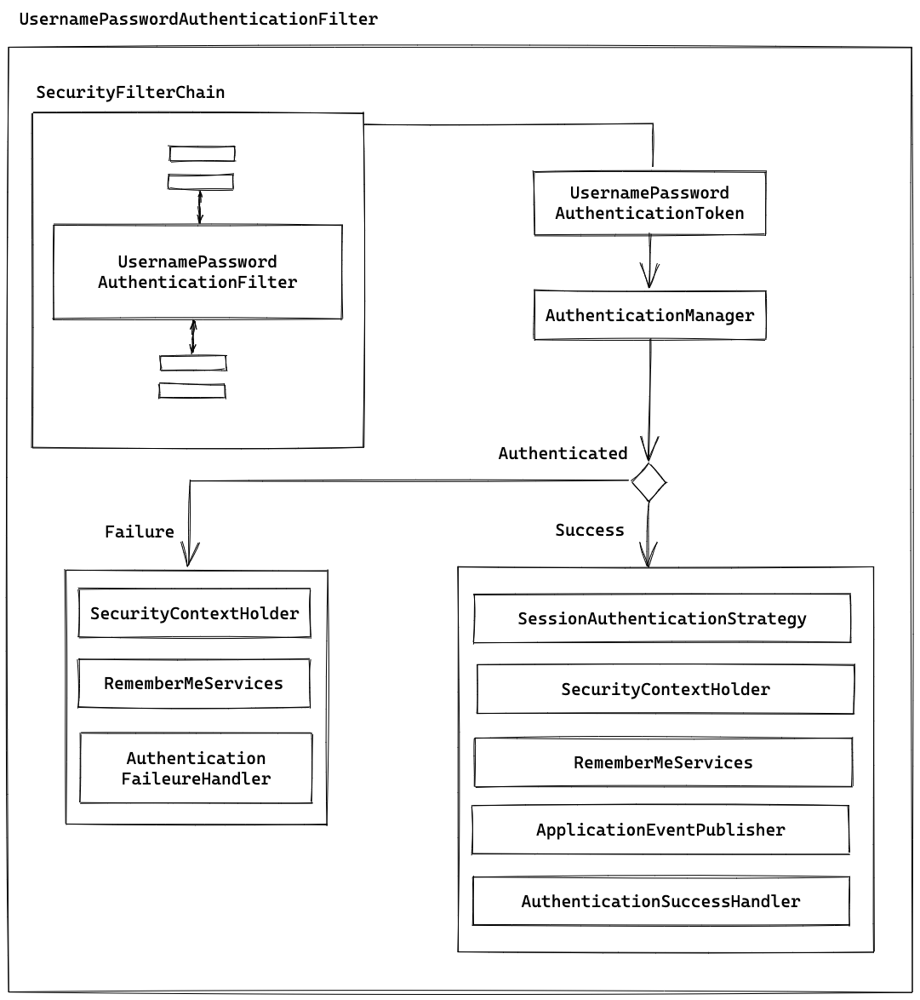
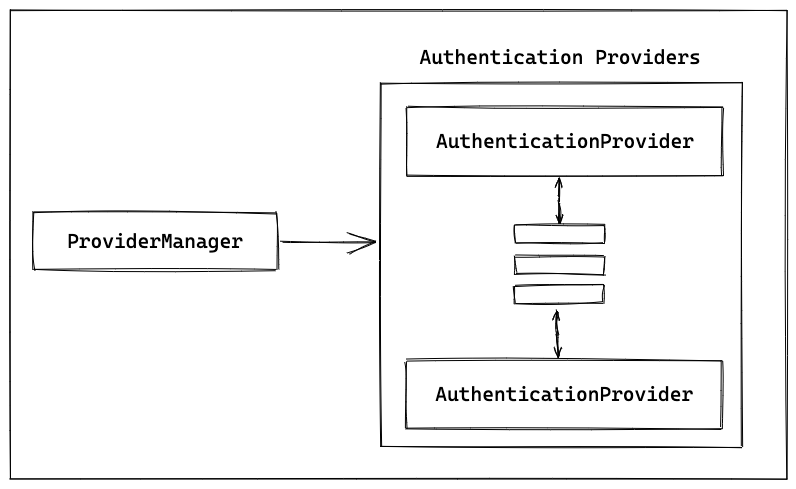

# 05 - Security Authentication

> ### 인증 (Authentication)



- `Authentication`
  - 사용자가 주장하는 본인이 맞는지 확인하는 절차를 의미한다.
  

- `DefaultLoginPageGeneratingFilter`
  - HTTP GET 요청에 대해 디폴트 로그인 페이지를 생성해주는 필터
  - 로그인 페이지 커스텀 구현이 가능하다.


> ### `AbstractAuthenticationProcessingFilter`
- `AbstractAuthenticationProcessingFilter`
  - 대표적인 구현체 : `UsernamePasswordAuthenticationFilter`
    - 사용자 인증을 처리하기 위한 필터
    - `Credential` : 사용자 인증을 위한 정보를 취합한다.
      - `UsernamePasswordAuthenticationFilter` 구현에서는 로그인 아이디/비밀번호를 취합한다.
    - `Authentication` : 객체를 생성한다.
      - `Authentication` 인터페이스 구현체중 하나인 `UsernamePasswordAuthenticationToken` 객체를 생성한다.



> ### `AuthenticationManager`
  - 인증이 완료되지 않은 `Authentication` 객체는 `AuthenticationManager` 객체를 반환한다.
  - 사용자 인증을 위한 API를 제공한다.


> ### `Authentication`
  - 인증이 정상적으로 완료됐을 경우 새로운 `Authentication`을 반환한다.
  - 새로운 `Authentication` 객체는 인증이 완료된 상태이다.
  - `GrantedAuthority` 목록을 포함하고 있다.


> ### `ProviderManager`
- `ProviderManager`
  - `AuthenticationManger`의 기본 구현체 클래스이다.
  - 1개 이상의 `AuthenticationProvider` 인터페이스 구현체로 구성된다.
  - `AuthenticationProvider` 인터페이스 구현체 중 하나를 결정하여 실제 인증을 처리한다.


> ### `AuthenticationProvider` 
- `AuthenticationProvider`
  - 객체는 true를 반환하는 `supports(Class<?> authentication)` 메서드를 통해 `Authentication`에 대해서 인증을 처리한다



  
```java
public interface AuthenticationProvider {
    Authentication authenticate(Authentication authentication) throws AuthenticationException;
    boolean supports(Class<?> authentication);
}

public class ProviderManager implements AuthenticationManager, MessageSourceAware, InitializingBean {

    private List<AuthenticationProvider> providers = Collections.emptyList();
    
    ...
}
```

