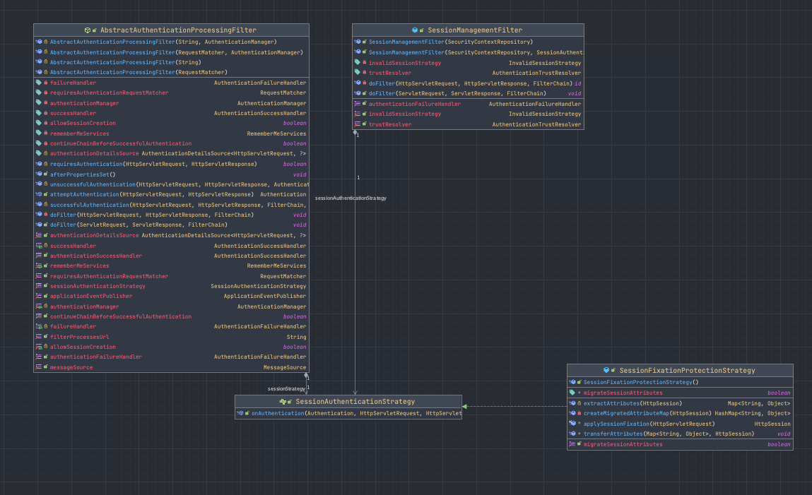

# 세션 처리

> ### SecurityContextPersistenceFilter

- `SecurityContextRepository`
  - SecurityContextRepository 인터페이스 구현체를 통해 사용자의 `SecurityContext`를 가져오거나 갱신한다.
    - 인증 관련 필터 중 가장 최상단에 위치한다.
      - 이미 인증된 사용자는 다시 로그인할 필요없게 처리해준다.


- SecurityContextRepository 인터페이스 기본 구현
  - `HttpSessionSecurityContextRepository`
    - Session을 이용한다.


> ### SessionManagementFilter

- 세션 고정 보호 (session-fixation protection)
  - session-fixation attack
    - 세션 하이재킹 기법
    - 정상 사용자의 세션을 탈취하려 인증을 우회하는 기법


- Spring Security가 제공하는 4가지 설정 옵션
  - `none`
    - 아무것도 하지 않는다.
    - 세션을 그대로 유지한다.
  - `newSession`
    - 새로운 세션을 만든다,.
    - 기존 데이터는 복제하지 않는다.
  - `migrateSession`
    - 새로운 세션을 만든다.
    - 데이터를 모두 복제한다.
  - `changeSession`
    - 새로운 세션을 만들지 않는다.
    - session-fixation 공격을 방어한다.


- 유효하지 않은 세션 감지 시 지정된 URL로 리다이렉트 시킨다.


- 세션 생성 전략 설정
  - `IF_REQUIRED`
    - 필요 시 생성한다. (default)
  - `NEVER`
    - Spring Security에서 세션을 생성하지 않는다.
    - 세션이 존재하면 사용은 한다.
  - `STATELESS`
    - 세션을 완전히 사용하지 않는다.
    - JWT 인증이 사용되는 REST API 서비스에 적합하다.
  - `ALWAYS`
    - 항상 세션을 사용한다.


- 동일 사용자 중복 로그인 감지 및 처리
  - `maximumSessions`
    - 동일 사용자의 최대 동시 세션 갯수
  - `maxSessionsPreventsLogin`
    - 최대 갯수를 초과하게 될 경우 인증 시도 차단 여부 (default : false)

```java
@Override
protected void configure(HttpSecurity http) throws Exception {
  http
    /**
     * 세션 관련 설정
     */
    .sessionManagement()
      .sessionFixation().changeSessionId()
      .sessionCreationPolicy(SessionCreationPolicy.IF_REQUIRED)
      .invalidSessionUrl("/")
      .maximumSessions(1)
	      .maxSessionsPreventsLogin(false)
				.and()
      .and()
  ;
}
```

- `AbstractAuthenticationProcessingFilter`
  - `SessionManagementFilter`와 동일한 세션 고정 보호, 최대 로그인 세션 제어를 수행한다.
  - AbstractAuthenticationProcessingFilter와 SessionManagementFilter는 `SessionAuthenticationStrategy`객체를 공유한다.
  - AbstractAuthenticationProcessingFilter 구현
    - 인증 처리 완료 후, SessionAuthenticationStrategy 객체를 통한 필요한 처리를 수행한다.

