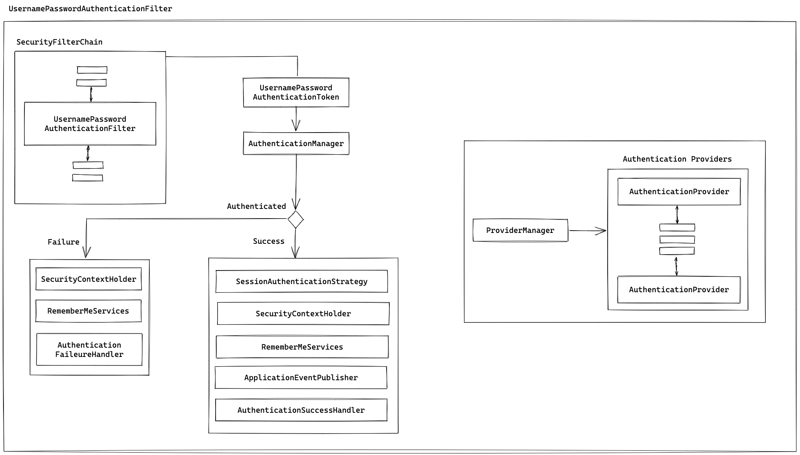

# Spring Security With Database

> ### 데이터베이스를 사용한 인증 적용

- `AuthenticationManager`는 사용자의 인증 처치를 위한 작업을 `AuthenticationProvider`로 위임한다.

- `UsernamePasswordAuthenticationToken` 타입의 인증 요청은 `DaoAuthenticationProvider`가 처리한다.

> ### DaoAuthenticationProvider

- 데이터베이스에서 사용자 인증 정보를 조회하는 작업을 `UserDetailService` 인터페이스 구현체에 위임한다.

- `UserDetailsService` 인터페이스 구현체
  - `org.springframework.security.core.userdetails.jdbc.JdbcDaoImpl` 구현체를 사용하면 된다.

> ### JdbcDaoImpl

  - JDBC를 통해 데이터베이스에서 사용자 인증 정보를 가져온다.
  - `JdbcDaoImpl` 객체를 Bean으로 등록하면 데이터베이스 기반 인증 처리가 완료된다.
  - `jdbcAuthentication` 메서드는 `UserDetailsService` 인터페이스 구현체로 `JdbcUserDetailsManager` 객체를 등록한다.

- `JdbcUserDetailsManager` 클래스는 `JdbcDaoImpl` 클래스를 상속한다.
