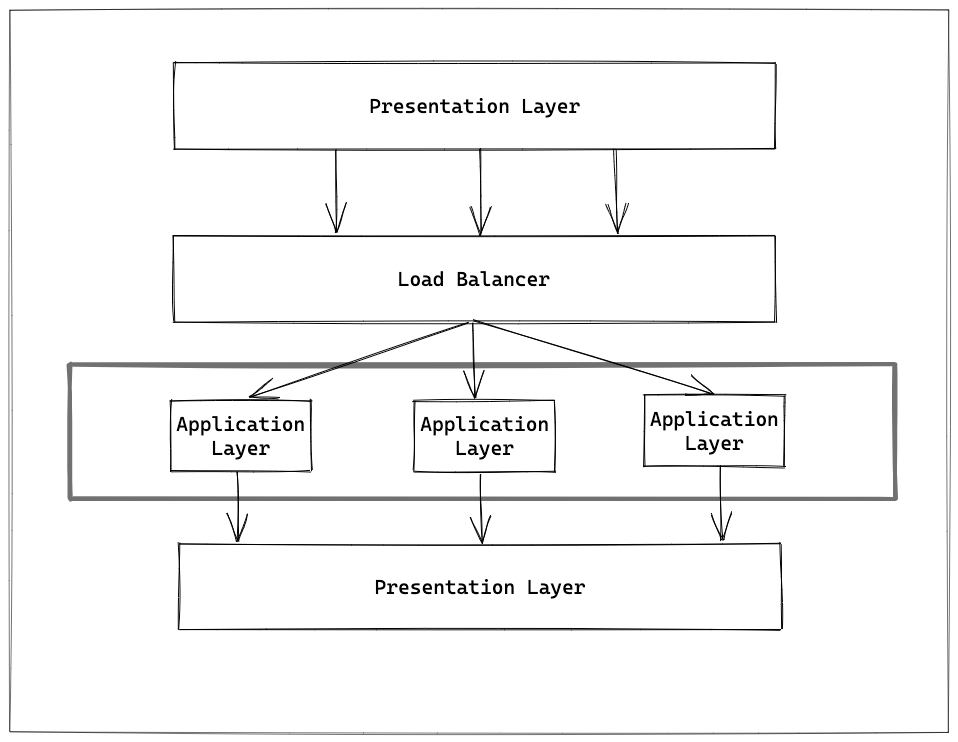
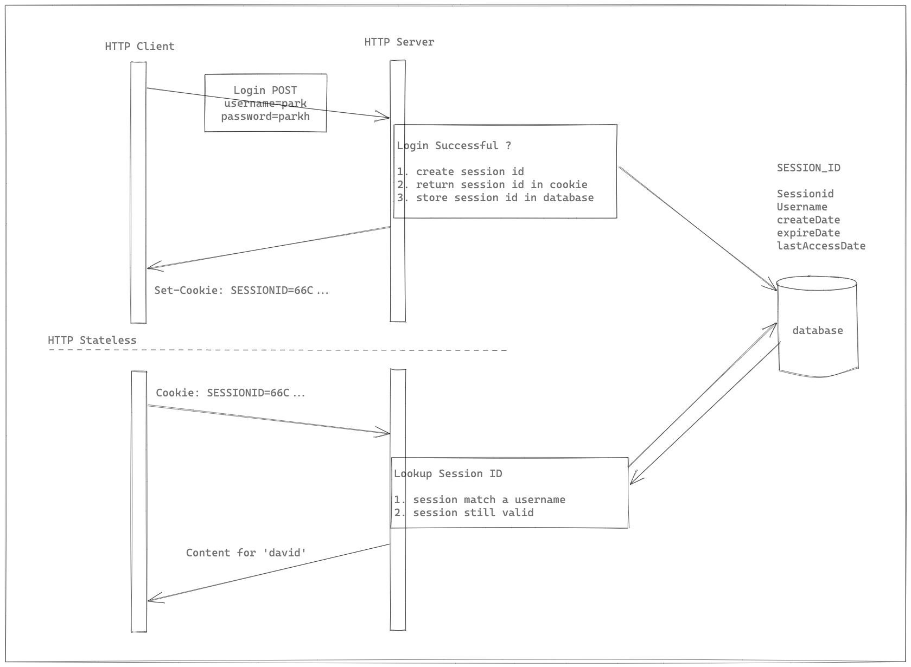
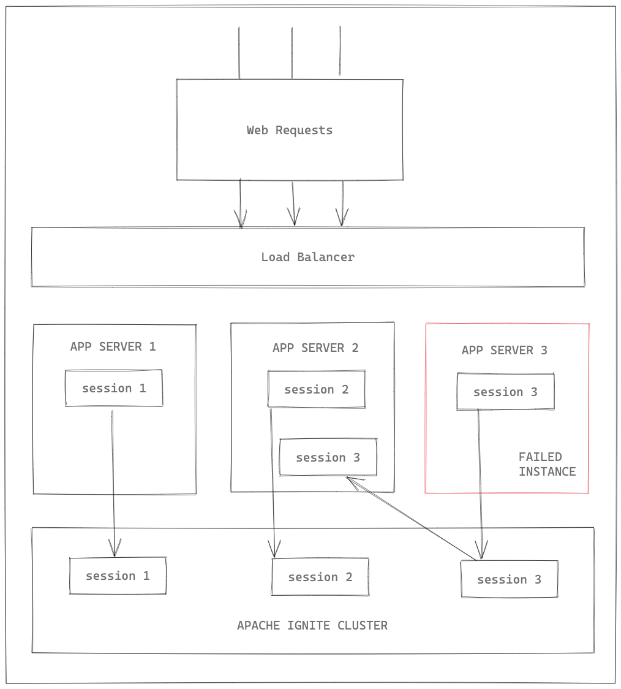
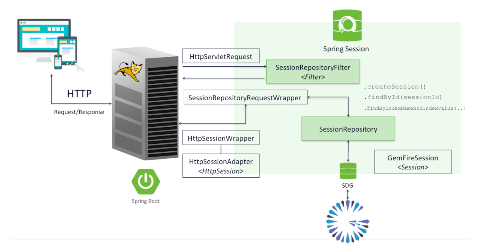

# Spring Session

> ### 3 Tier Architecture

- Presentation Layer
  - 사용자와의 접점 제공
- Application Layer
  - 트랜잭션 처리를 위한 비즈니스 로직 제공
- Data Layer
  - 데이터를 저장하고 조회하는 기능 제공


- 각 계층을 모듈화한다.
- 다른 계층에 미치는 영향을 최소화하여 확장이 용이하다.


- Application Layer의 서버 수평 확장
  - 서비스 앞단에 Load Balancer를 배치하여 트래픽을 분산한다.
- 특정 서버에 장애 발생시
  - 서비스 측면에서는 문제가 없다.
  - 사용자 인증 처리에서 Session을 사용했다.
  - 장애가 발생한 서버에서 인증된 사용자는 인증이 풀리게 된다.
      - 다시 인증해야 한다.




> ### HTTP, Session

- HTTP
  - 무상태 프로토콜
  - 어떤 정보도 저장하지 않는다.
- Server
  - 인증된 사용자 정보를 저장하기 위해 Session을 만든다.
  - 식별자인 session-id를 Client로 응답한다.
- Client
  - HTTP 요청에 session-id를 포함시켜, Server가 Client를 식별할 수 있도록 한다.
  - Session은 서버 메모리를 사용하기 때문에, 서버 메모리 부족이 발생할 수 있다.
  - 서버 장애시 Session 정보는 유실된다.



> ### Session Cluster

- Session 기반 인증 처리의 문제점이 Session이 서버 메모리에 저장되는 것 
  - => Session을 별도의 외부 스토리지에 저장한다는 개념이다.
- 외부 스토리지는 In-Memory DB를 많이 사용한다. 
  - => 조회 속도를 위해
- 특정 서버에 문제가 생겨도 다른 정상적인 서버에서 Sessiondㅡㄹ 외부 스토리지에서 가져올 수 있다.
  - => 사용자 인증이 풀리지 않는다.
- Sticky Connection 제약에서 자유롭다.
  - => 동일한 사용자가 발생시킨 요청을 동일한 WAS에서 처리됨을 보장한다.


- 단점
  - Session을 저장하기 위해 별도 외부 스토리지가 필요하다.
  - 외부 스토리지 장애 발생 시 대규모 장애 발생 가능성이 커진다.
    - Session Cluster를 위한 외부 스토리지가 SPOF 지점이 되는 것을 방지하기 위해 외부 스토리지는 보통 Cluster로 구성된다.



> ### Spring Session

- 스토리지 종류에 따라 여러 모듈이 있다.
  - spring-session-jdbc
  - spring-session-data-redis
  - spring-session-hazelcast
  - spring-session-data-mongodb


- Spring Session 관련 테이블 초기화
  - sql.init.mode
  - spring-session-jdbc
    - session 정보를 저장하기 위해 2개의 테이블을 사용한다.
    - 테이블 생성 SQL 쿼리 파일 : org/springframework/session/jdbc/schema-h2.sql
    - 테이블을 추가하기 위한 SQL 쿼리 파일은 spring-session-jdbc jar 내부에 위치한다.


- Spring Session 관련 설정

```yaml
session:
  store-type: jdbc
#  jdbc:
#    initialize-schema: never
```

- session.store-type: jdbc
  - jdbc외에 redis, mongodb, hazelcast 등이 있다.


- @EnableJdbcHttpSession
  - jdbc 기반 spring session 활성화

```java
@Configuration
@EnableJdbcHttpSession
public class WebMvcConfigure implements WebMvcConfigurer {

    @Override
    public void addViewControllers(ViewControllerRegistry registry) {
        registry.addViewController("/").setViewName("index");
        registry.addViewController("/me").setViewName("me");
        registry.addViewController("/admin").setViewName("admin");
    }
}
```

> ### Spring Session - SessionRepository, SessionRepositoryFilter

- SessionRepository
  - Session의 생성, 저장, 조회, 삭제 처리에 대한 책임을 갖는다.
  - 스토리지 종류에 따라 다양한 구현체를 제공한다.
    - MapSessionRepository
      - In-Memory Map 기반
      - 별도의 의존 라이브러리가 필요 없다.
    - RedisIndexedSessionRepository
      - redis 기반이다.
      - @EnabledRedisHttpSession 어노테이션으로 생성된다.
    - JdbcIndexedSessionRepository
      - jdbc 기반이다.
      - @EnabledJdbcHttpSession 어노테이션으로 생성된다.

```java
public interface SessionRepository<S extends Session> {
    S createSession();
    void save(S session);
    S findById(String id);
    void deleteById(String id);
}
```

- SessionRepositoryFilter
  - 모든 HTTP 요청에 대해 동작한다.
  - HttpServletRequest 인터페이스 구현 
    - SessionRepositoryRequestWrapper 구현체로 교체한다.
  - HttpServletResponse 인터페이스 구현 
    - SessionRepositoryResponseWrapper 구현체로 교체한다.
  - HttpServletRequest, HttpServletResponse 인터페이스의 Session 처리와 관련된 처리를 Override 한다.
    - Session 관련 생성 및 입출력 
      - SessionRepository 인터페이스를 통해 처리한다.
    - HttpSession 인터페이스
      - Spring Session 구현체 HttpSessionWrapper를 사용한다.
    - HttpSessionWrapper 구현체
      - org.springframework.session.Session 인터페이스를 포함하고 있다.
      - 스토리지 종류에 따라 org.springframework.session.Session 인터페이스 구현체가 달라진다.



- Spring Session의 SessionRepositoryFilter 클래스
  - Spring Security의 DelegatingFilterProxy 보다 먼저 실행된다.


- Spring Security의 SecurityContextPersistenceFilter
  - SecurityContextRepository 인터페이스 구현체를 통해 사용자의 SecurityContext를 가져오거나 갱신한다.
  - SecurityContextRepository 인터페이스 기본 구현체
    - Session을 이용하는 HttpSessionSecurityContextRepository 클래스이다.
  - HttpServletRequest 인터페이스의 getSession() 메서드를 통해 Session을 가져온다.
    - 여기서 HttpServletRequest 인터페이스의 스프링 세션 구현체인 SessionRepositoryRequestWrapper 클래스가 사용된다.

```java
@Override
public SecurityContext loadContext(HttpRequestResponseHolder requestResponseHolder) {
	HttpServletRequest request = requestResponseHolder.getRequest();
	HttpServletResponse response = requestResponseHolder.getResponse();
	HttpSession httpSession = request.getSession(false);
	SecurityContext context = readSecurityContextFromSession(httpSession);
	if (context == null) {
		context = generateNewContext();
		if (this.logger.isTraceEnabled()) {
			this.logger.trace(LogMessage.format("Created %s", context));
		}
	}
	SaveToSessionResponseWrapper wrappedResponse = new SaveToSessionResponseWrapper(response, request, httpSession != null, context);
	requestResponseHolder.setResponse(wrappedResponse);
	requestResponseHolder.setRequest(new SaveToSessionRequestWrapper(request, wrappedResponse));
	return context;
}
```

- Spring Security는 수정할 필요가 없다.
  - Spring Session은 HttpSession과의 투명한 통합을 제공하고 있다.