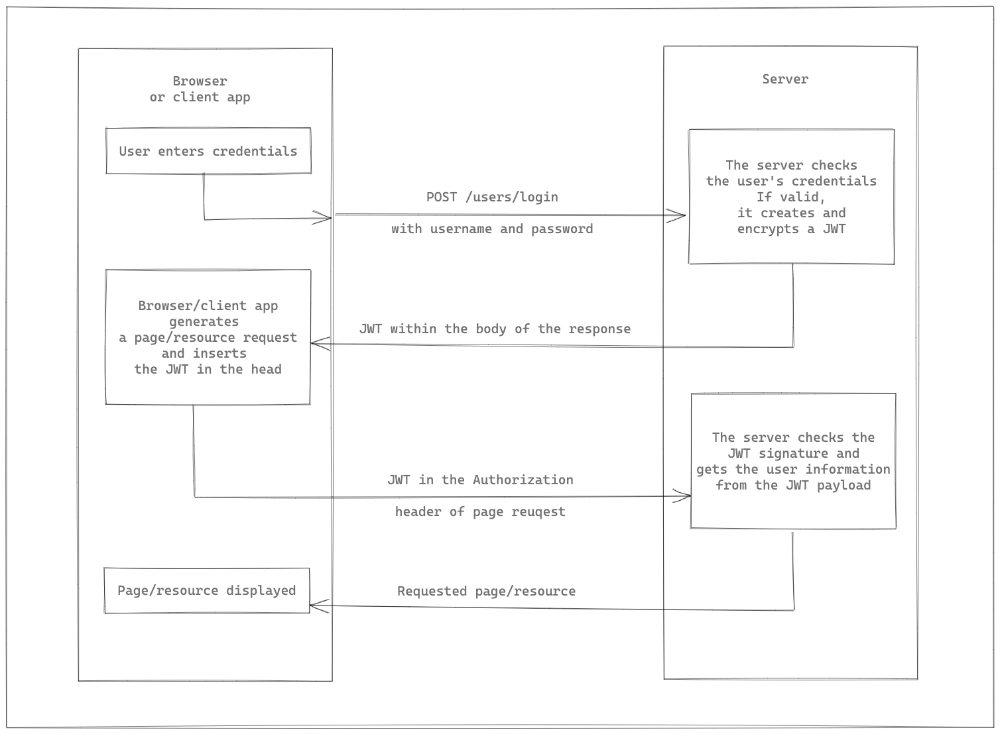

# Spring Security, JWT

> ### REST API, Stateless Architecture

- REST API
  - HTTP 프로토콜 기반이라면 응용 가능하다.
  - 3 계층 아키텍처 구조와 REST API 서비스 호환이 좋다.
  - REST API 서비스에서 Session을 사용하는 것은 서비스에 따라 다르다.

- Stateful & Stateless
  - Stateful 아키텍처 장단점
    - Session을 사용하면 Stateful하다.
    - 수평 확장 과정이 어렵다.
      - Session Cluster가 필요하다.
    - 단일 사용자의 다중 로그인 컨트롤 구현이 쉽다.
    - 사용자 유효성 체크 구현이 쉽다.
    - 강제 로그아웃 기능 구현이 쉽다.
  - Stateless 아키텍처 장단점
    - Session을 전혀 사용하지 않는다.
      - HTTP 프로토콜은 Stateless하다.
    - 수평 확장이 쉽다.
      - Session Cluster가 필요하지 않다.
    - 단일 사용자의 다중 로그인 컨트롤 구현이 어렵다.
    - 사용자 유효성 체크 구현이 어렵다.
    - 강제 로그아웃 기능 구현이 어렵다.
    - 완전한 Stateless 아키텍처 기반으로 유의미한 서비스 개발이 어렵다.
      - 완전한 Stateless 서비스는 정적 리소스를 서비스 하는데 적합하다.
      - 서버는 사용자를 식별할 수 있어야 한다. (Session을 사용하지 않는 상태)

> ### JWT

- JWT는 Stateless 상태를 유지한다.
- 서버에서 사용자를 식별할 수 있는 수단을 제공한다.
  - 서버에서 사용자가 성공적으로 인증되면 JWT를 반환한다.
  - 클라이언트는 JWT를 로컬 영역에 저장하고, 이후 서버에 요청을 보낼때 JWT를 HTTP header에 포함시킨다.
  - 서버는 클라이언트가 전달한 JWT를 통해 사용자를 식별할 수 있다.

- Json Web Token 특징
  - JSON Format을 사용하여 데이터를 만들기 위한 웹 표준이다. (RFC 7519)
  - JWT는 자체적으로 필요한 모든 정보를 지니고 있다.
    - 토큰에 대한 메타 정보
      - 토큰 타입
      - 사용된 해시 알고리즘
    - 인터넷 상에서 쉽게 전달할 수 있다.
      - URL-Safe 텍스트로 구성된다.
      - 때문에 HTTP 프로토콜의 어느 위치에든 들어갈 수 있다.
      - 보통 HTTP header에 들어간다.
    - 위변조 검증 가능
      - 토큰이 위변조 되지 않았음을 증명하는 서명을 포함한다.

> ### Json Web Token 구조
  - Header, Payload, Signature 으로 구성된다.
  - Header, Payload, Signature 를 Base64 Url-Safe 방식으로 인코딩한다.
  - dot(.)을 구분자로 결합한다.

- Header
  - JWT를 검증하는데 필요한 정보를 가지고 있다.
    - 알고리즘은 HMAC, RSA 방식을 지원한다.
    - HMAC 알고리즘
      - 비밀키는 최소한 알고리즘의 서명 길이만큼의 비트를 가지고 있어야 한다.
      - HS512 - 64byte

- Payload
  - JWT를 통해 전달하고자 하는 데이터 
    - Claim-Set 이라고 한다.
    - Claim 자체는 Key-Value를 의미한다.
  - JWT 자체는 암호화되는 것이 아니다.
  - 때문에 민감 정보를 포함해서는 안된다.
  - Reversed Claims, Public Claims, Custom Claims 으로 구분된다.
    - `Reversed Claims`
      - 미리 등록된 Claims 필수적으로 사용할 필요는 없다. (하지만 사용을 권고한다.)
      - `iss` : 토큰 발급자
      - `exp` : 만료 시간이 지난 토큰은 사용이 불가능하다.
      - `nbf` : Not Before의 의미로 해당 시간 이전에는 토큰 사용이 불가능하다.
      - `iat` : 토큰이 발급된 시각
      - `jti` : JWT ID로 토큰에 대한 식별자
    - `Public Claims`
      - 사용자 마음대로 사용할 수 있다.
      - 충돌 방지를 위해 미리 정의된 이름으로 사용하는 것을 권고한다.
    - `Customer Claims`
      - 사용자 정의 Claims
      - Reversed, Public에 정의된 이름과 중복하지 않게 해야한다.

- Signature
  - 토큰 생성 주체만 알고 있는 비밀키를 이용하여 header에 정의된 알고리즘으로 서명된 값이다.
  - 토큰이 위변조 되지 않았음을 증명한다.

> ### Json Web Token 장단점 (Stateless, Stateful)

- 장점
  - 사용자 인증에 필요한 모든 정보는 토큰 자체에 포함하기 때문에 따로 스토리지가 필요없다.
    - 수평 확장이 쉽다.
    - Session Cluster가 필요없다.
  - Active User가 많은 서비스에 JWT 사용이 유리하다.
    - Session을 사용할 경우 Active User 수 만큼 Session을 저장해야 한다.
      - 스토리지 관리가 어려워진다.

- 단점
  - 토큰 크기를 가능한 작게 유지해야 한다.
    - 토큰 자체가 항상 HTTP request에 포함되어야 한다.
      - 토큰이 커지면 불리해진다.
  - 유효기간이 남아 있는 정상적인 토큰에 대해 강제적으로 만료 처리가 어렵다.
    - Session을 사용할 경우 동시 Session 제어, Session 만료 처리 등 보안상 이점이 있다.