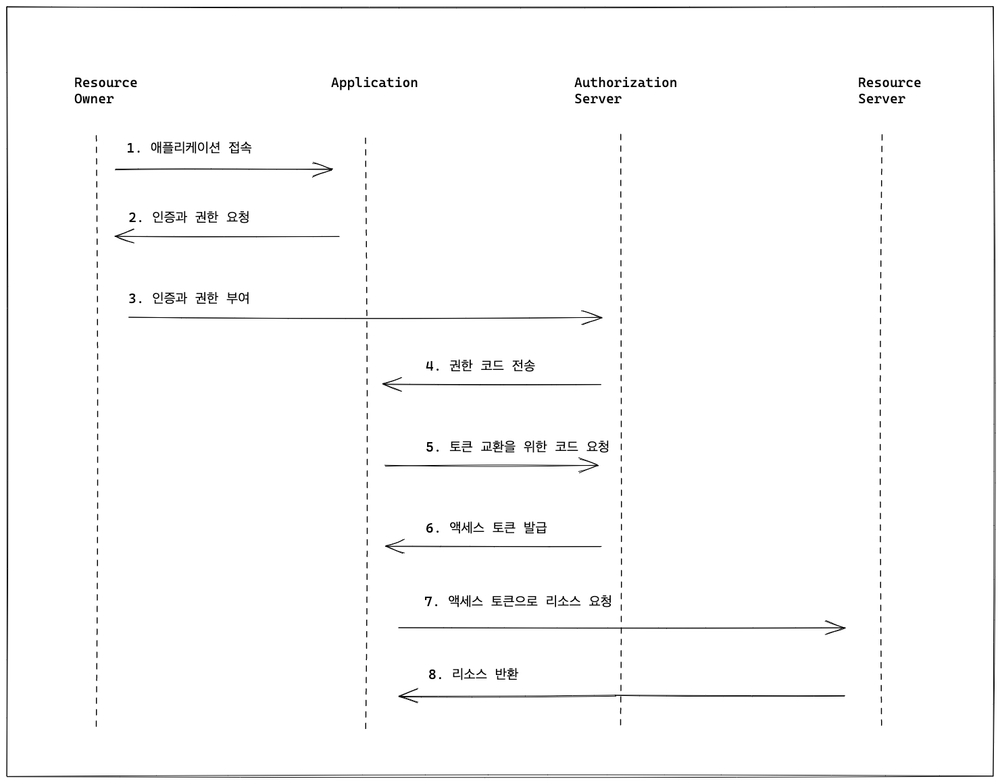
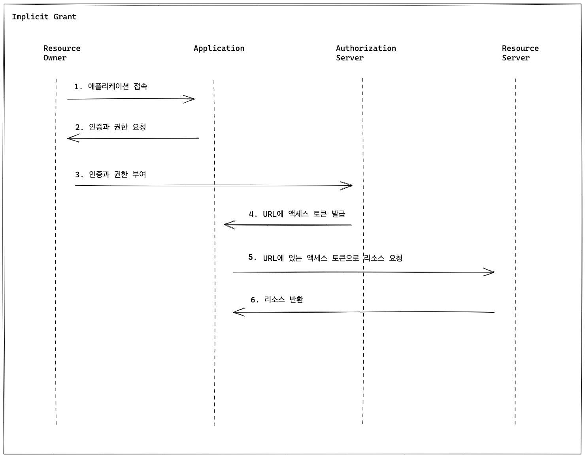
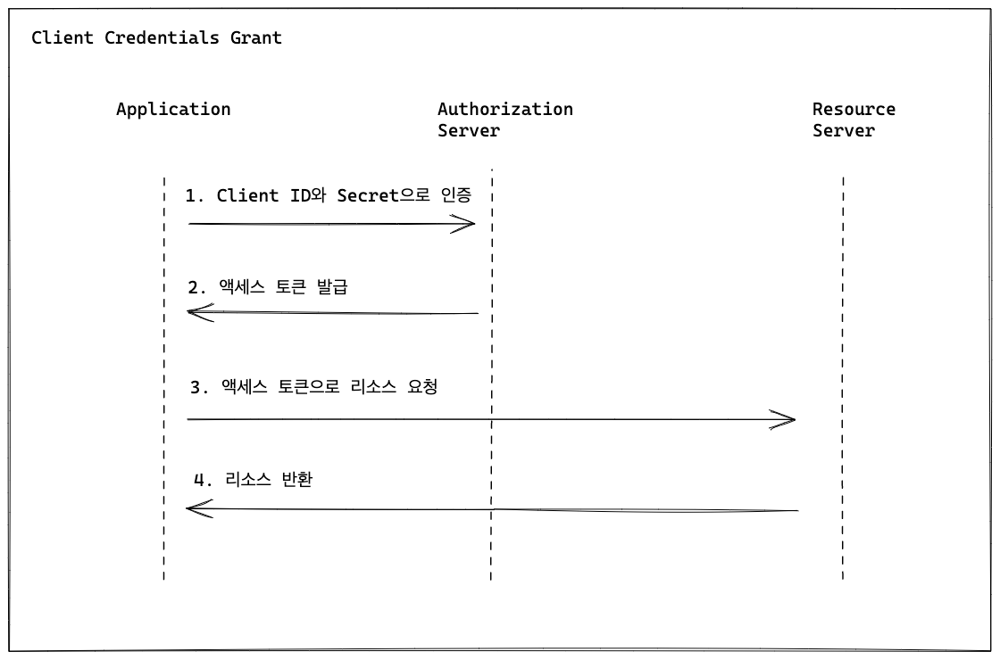
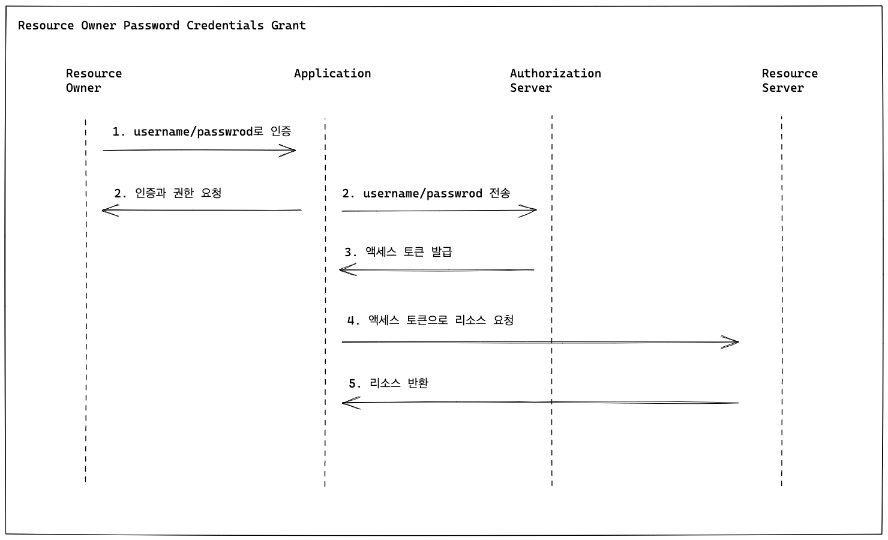

# OAuth2.0

- 이해하기
  - 사용자가 가입된 서스에서 제공하는 API를 이용하여 사용자 데이터에 접근하려 한다.
  - 사용자 데이터 접근하기 위해서는 권한이 있어야 하므로 사용자로부터 권한을 위임받으면 된다.
  - 이 때 사용자의 패스워드 없이도 권한을 위임 받아야 한다.
  - 이를 위해서 OAuth2.0 (Open Authorization, Open Authentication 2) 라는 표준 인증 프로토콜을 이용하여 처리한다.


- OAuth 용어
  - Resource Owner
    - 서비스를 이용하는 사용자
    - 리소스 소유자
  - Client
    - 리소스 소유자를  대신하여 보호된 리소스에 액세스하는 응용 프로그램
  - Resource Server
    - 보호받는 리소스를 호스팅하고 액세스 토큰을 사용하는 클라이언트의 요청을 수락하고 응답할 수 있는 서버
    - 카카오, 네이버 등의 리소스 서버
  - Authorization Server
    - 클라이언트 및 리소스 소유자를 성공적으로 인증한 후 액세스 토큰을 발급하는 서버
    - 카카오, 네이버 등의 인증 서버

> ### Client이 Authorization server에게 요청하는 토큰 발생 4가지 방법

- ### Authorization Code Grant
  - OAuth2.0에서 가장 중요하다.
  - 많이 사용되는 인증 방법이다.
  - 클라이언트는 써드파티 서비스의 백엔드 서버가 된다.
  - 사용자 인증 후 Callback을 통해 authorization code를 받는다.
    - client-id, client-server와 함꼐 Access-Token으로 교환한다.
  - Callback 처리는 백엔드 서버에서 이루어진다.
    - Access-Token이 외부에 노출되지 않는다.
  - 4단계 처리 Flow
    - Authorization Request
      - 클라이언트는 사용자를 Authorization Server로 리다이렉션한다.
    - Authorization Response
      - 클라이언트에서 요구하는 리소스에 대해 사용자 동의를 받고, 요청과 함께 전달된 redirect_uri로 리다이렉션한다.
    - Token Request
      - 승인 코드를 Access-Token 으로 교환한다.
    - Token Response
      - Access-Token 및 부가정보 획득
  - Authorization Request
    - response_type : code 고정
    - client_id : Authorization Server에서 클라이언트를 식별하기 위한 식별키
    - scope : 클라이언트가 요구하는 리소스 정의
    - state : 클라이언트는 임의의 문자열을 생성하여 CSRF 공격을 방지
    - redirect_uri : Authorization Server에서 처리 완료 후 리다이렉션 하기 위한 URL
    ```text
    https://kauth.kakao.com/oauth/authorize
    ?response_type=code
    &client_id=0492f15cb715d60526a3eb9e2323c559
    &scope=profile_nickname%20profile_image
    &state=xI8tRNCSoeiAIw87NaUr5foPbhBhW2METzHDBK75jgo%3D
    &redirect_uri=http://localhost:8080/login/oauth2/code/kakao
    ```
  - Authorization Response
    - code : Access-Token 교환을 위한 승인 코드
    - state : 요청과 함께 전달된 임의의 문자열
    ```text
    /login/oauth2/code/kakao
    ?code=jzcahTyqbAx4zs9pKfBDlGXmB36sPX2YJCNIIw0RKkW_ODsYTQpheSGABo17dHC5rXRD2Qopb9QAAAF76FELEg
    &state=xI8tRNCSoeiAIw87NaUr5foPbhBhW2METzHDBK75jgo%3D
    ```
  - Token Request
    - grant_type : authorization_code 고정
    - code : 앞 단계에서 전달받은 코드
    - client_id : Authorization Server 에서 클라이언트를 식별하기 위한 식별키
    - client_secret : 클라이언트 비밀키
    ```text
    HTTP POST https://kauth.kakao.com/oauth/token
    Accept=[application/json, application/*+json]
    Writing [
    {grant_type=[authorization_code],
    code=[jzcahTyqbAx4zs9pKfBDlGXmB36sPX2YJCNIIw0RKkW_ODsYTQpheSGABo17dHC5rXRD2Qopb9QAAAF76FELEg],
    redirect_uri=[http://localhost:8080/login/oauth2/code/kakao],
    client_id=[0492f15cb715d60526a3eb9e2323c559],
    client_secret=[oqoKOBecGMC45Uh7z7bmdtMJ0A4PSQ2l]}
    ] as "application/x-www-form-urlencoded;charset=UTF-8"
    ```
  - Token Response
    - access_token : 리소스 요청에 필요한 토큰 (보통 짧은 생명주기)
    - refresh_token : Access-Token을 갱신하기 위한 토큰

  

- ### Implicit Grant
  - Authorization Code Grant 방식과 비교했을 때, Authorization Response 단계에서 Access-Token이 전달되고 Token Request 단계가 생략된다.
  - Access-Token이 URL에 노출되기 때문에 보안상 리스크가 있다.
  - 백엔드 서버가 없는 제한적인 환경에서만 사용을 권장한다.
    - 브라우저에서 JS와 같은 스크립트 언어로 동작하는 클라이언트
  
  

- ### Client Credentials Grant
  - client_id, client_secret 파라미터만 가지고 Access-Token을 발급할 수 있다.
    - 사용자는 관여하지 않는다.
  - 사용자의 직접적인 상호 작용 없이 백그라운드에서 실행해야 하는 서버 간 상호 작용에 사용한다.

  

- ### Resource Owner Password Credentials Grant
  - Client Credentials Grant 방식과 매우 유사하다.
    - client_id, client_secret 대신 사용자 비밀번호로 인증된다.
  - 일반 로그인 아이디/비밀번호 인증
  - 클라이언트를 완전히 신뢰할 수 있을 때 사용한다.
  
  

