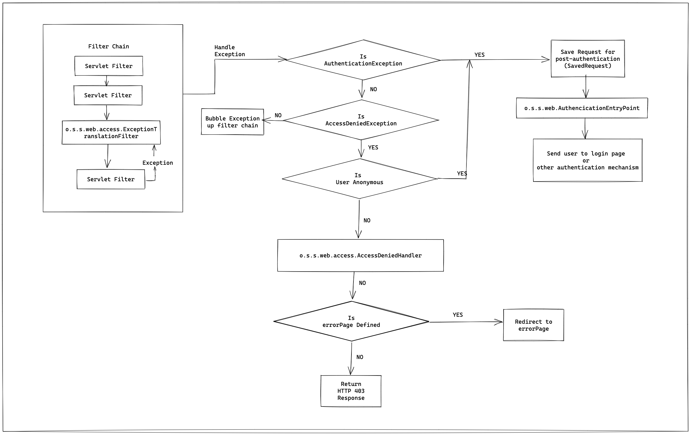
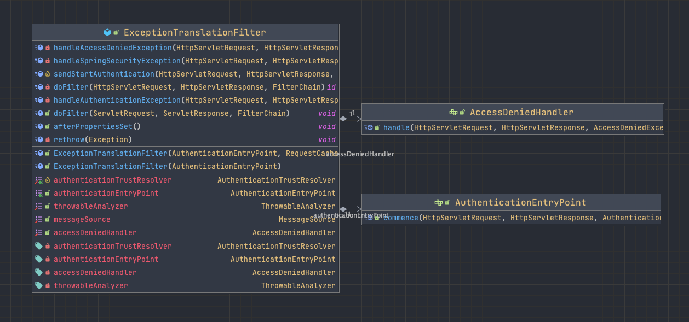

# 02. Spring Security Architecture

> ### AnonymousAuthenticationFilter

- `AnonymousAuthenticationFilter`
  - 해당 필터에 요청이 도달할 때까지 사용자가 인증되지 않았다면
  - 사용자를 `null` 대신 `Anonymous` 인증 타입으로 표현한다.
    - 더 구체적으로 타입을 확인할 수 있도록 도와준다.

```java
public class AnonymousAuthenticationFilter extends GenericFilterBean implements InitializingBean {
  public void doFilter(ServletRequest req, ServletResponse res, FilterChain chain) throws IOException, ServletException {
    if (SecurityContextHolder.getContext().getAuthentication() == null) {
      SecurityContextHolder.getContext().setAuthentication(this.createAuthentication((HttpServletRequest) req));
      if (this.logger.isTraceEnabled()) {
        this.logger.trace(LogMessage.of(() -> {
          return "Set SecurityContextHolder to " + SecurityContextHolder.getContext().getAuthentication();
        }));
      } else {
        this.logger.debug("Set SecurityContextHolder to anonymous SecurityContext");
      }
    } else if (this.logger.isTraceEnabled()) {
      this.logger.trace(LogMessage.of(() -> {
        return "Did not set SecurityContextHolder since already authenticated " + SecurityContextHolder.getContext().getAuthentication();
      }));
    }

    chain.doFilter(req, res);
  }

  /**
   * 익명 인증 타입 토큰을 생성하는 것을 볼 수 있다.
   */
  protected Authentication createAuthentication(HttpServletRequest request) {
    AnonymousAuthenticationToken token = new AnonymousAuthenticationToken(this.key, this.principal, this.authorities);
    token.setDetails(this.authenticationDetailsSource.buildDetails(request));
    return token;
  }
    
  ...
}
``` 

> ### ExceptionTranslationFilter

- `ExceptionTranslationFilter`
  - `FilterSecurityInterceptor` 바로 위에 위치해있다.
  - `FilterSecurityInterceptor` 실핼 중 발생할 수 있는 예외를 잡고 처리한다.

> - `ExceptionTranslationFilter`는 필터 체인 실행 스택에서 자기 아래에 오는 필터들에서 발생하는 예외들에 대해서만 처리할 수 있다.
> 
> - 커스텀 필터를 추가해야하는 경우, 커스텀 필터를 적당한 위치에 두어야 한다.

- `ExceptionTranslationFilter`는 
  - `FilterSecurityInterceptor` 실행 중 발생 가능한 `AuthenticationException`, `AccessDeniedException` 예외에 대한 처리를 담당한다.
- `AuthenticationException`
  - 인증 관련 예외이다. 
  - 사용자를 로그인 페이지로 보낸다.
- `AccessDeniedException` 
  - `AccessDecisionManager`에 의해 접근 거부가 발생했을 때 접근 거부 페이지를 보여주거나 사용자를 로그인 페이지로 보낸다.
- `AuthenticationEntryPoint`
  - 인증되지 않은 사용자 요청을 처리할 때 핵심적인 역할을 수행한다.
  - 보통은 사용자를 로그인 요청 페이지로 포워딩하는 역할을 한다.
  - 폼 기반 로그인 인증 외의 다른 인증 매커니즘을 처리할 때도 사용한다.
    - ex) CAS 인층 처리 => CAS 포탈로 사용자를 이동시킨다.
    - ex) 서드 파티 시스템과 연동이 필요한 경우 `AuthenticationEntryPoint`를 직접 구현할 수도 있다. 


 
