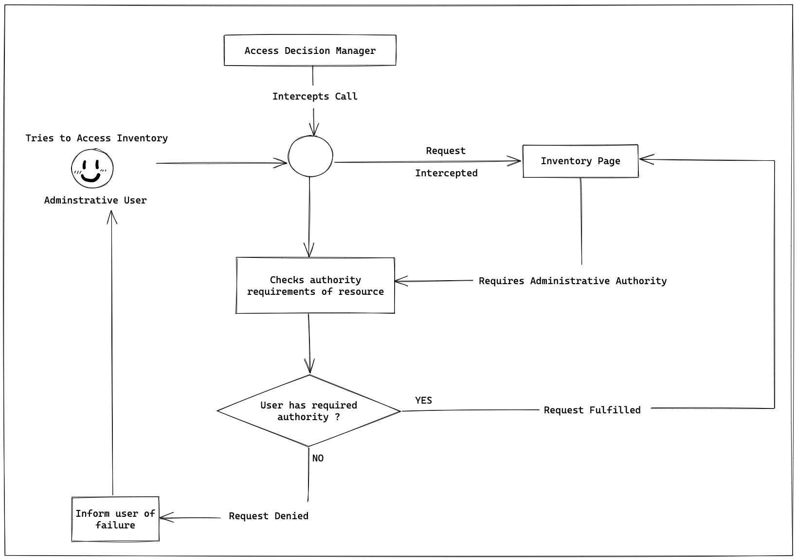
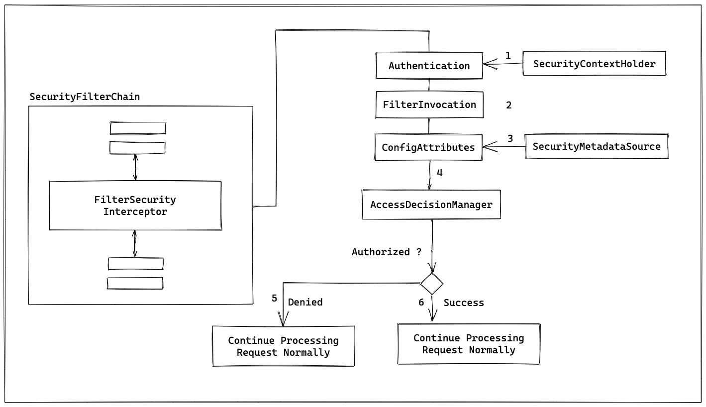

# Authorization 처리

> ### Authorization

- 인가 (`Authorization`)
  - 권한이 부여된 사용자들만 특정 기능, 데이터 접근에 허용하는 기능


- 인가 처리
  - 인증된 사용자와 권한을 매핑해야 한다.
    - Spring Security
      - ROLE_USER
      - ROLE_ADMIN
      - ROLE_ANONYMOUS
  - 보호되는 리소스에 대한 권한을 확인해야 한다.

    


> ### FilterSecurityInterceptor

- 필터 체인 상에서 가장 마지막에 위치한다.
- 사용자가 갖고 있는 권한과 리소스에서 **요구하는 권한을 취합**하여 접근 허용을 결정한다.
  - `AccessDecisionManager` 인터페이스 구현체
    - 접근 허용 판단 여부가 이루어진다.


- `FilterSecurityInterceptor` 필터가 호출되는 시점
  - 해당 시점에서 사용자는 인증이 완료된다.
- `Authentication` 인터페이스의 `getAuthorities()` 메서드
  - 인증된 사용자 권한 목록을 가져온다.
  - 익명 사용자도 인증이 완료된 것으로 간주한다.
    - ROLE_ANONYMOUS
- `SecurityMetadataSource` 인터페이스
  - `ConfigAttribute` 타입
  - 보호되는 리소스에서 요구하는 권한 정보를 해당 타입으로 가져온다.




> ### AccessDecisionManager

- `AccessDecisionManager` 인터페이스
  - 사용자가 갖고 있는 권한과 리소스에서 요구하는 권한을 확인한다.
  - 사용자가 적절한 권한을 갖고 있지 않다면 접근 거부 처리한다.
  - `AccessDecisionVoter` 목록을 가지고 있다.
  - AccessDecisionVoter들의 투표(vote) 결과를 취합하고, 접근 승인 여부를 결정하는 3가지 구현체를 제공한다.
    - `AffirmativeBased`
      - AccessDecisionVoter가 승인하면 이전에 거부된 내용과 관계없이 접근이 승인된다. (default)
    - `ConsensusBased`
      - 다수의 AccessDecisionVoter가 승인하면 접근이 승인된다.
    - `UnanimousBased`
      - 모든 AccessDecisionVoter가 만장일치로 승인해야 접근이 승인된다.

> ### AccessDecisionVoter

- `AccessDecisionVoter` 인터페이스
  - 각각의 AccessDecisionVoter는 접근 승인, 거절, 보류를 판단한다.
```java
int ACCESS_GRANTED = 1;
int ACCESS_ABSTAIN = 0;
int ACCESS_DENIED = -1;

int vote(Authentication authentication, S object, Collection<ConfigAttribute> attributes);
```
  - ACCESS_GRANTED
    - 접근 승인
  - ACCESS_DENIED
    - 접근 거부
  - ACCESS_ABSTAIN
    - 판단 보류


> ### `WebExpressionVoter` 구현체
  - SpEL 표현식을 사용해 접근 승인 여부에 대한 규칙을 지정한다.
  - SpEL 표현식 처리를 위해 
    - `DefaultWebSecurityExpressionHandler`
    - `WebSecurityExpressionRoot` 구현에 의존한다.


- `DefaultWebSecurityExpressionHandler`
  - createSecurityExpressionRoot() 메서드에서 `WebSecurityExpressionRoot` 객체를 생성한다.
- `WebSecurityExpressionRoot`
- SpEL 표현식에서 사용할 수 있는 다양한 메서드 제공